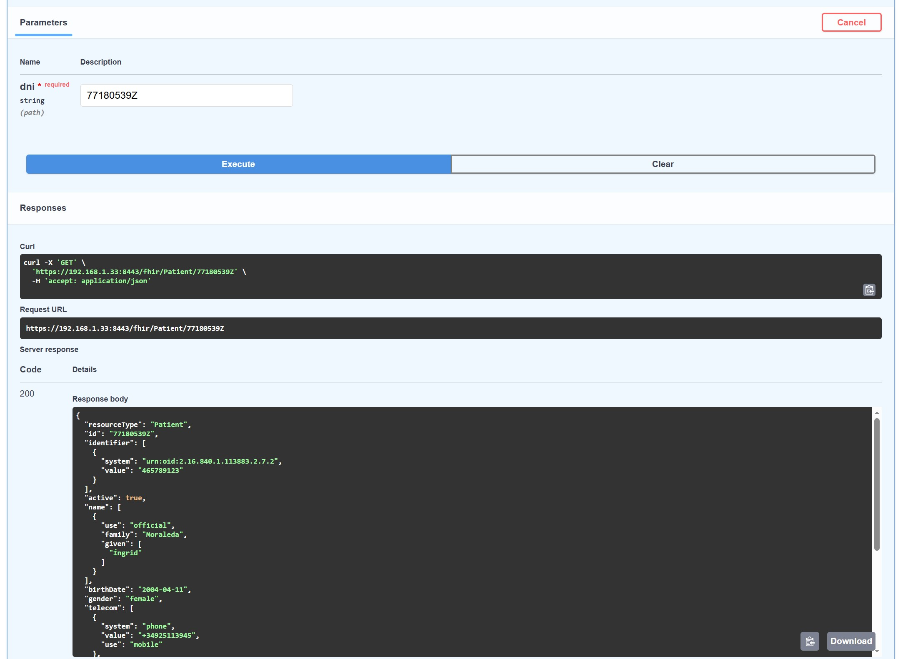
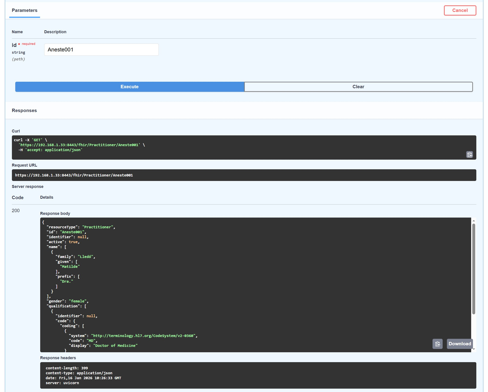
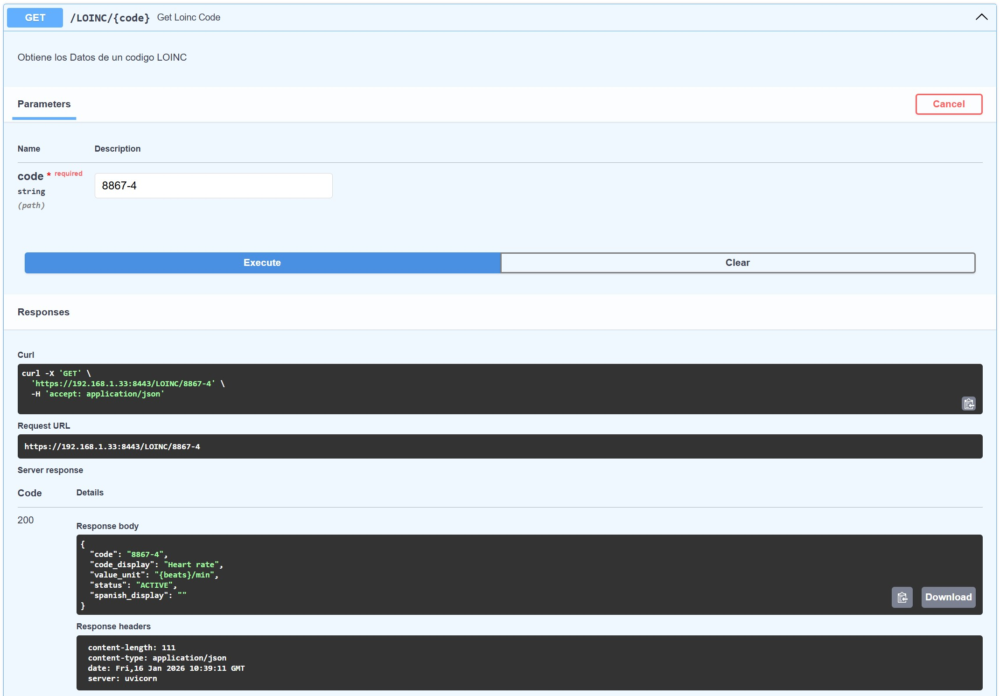
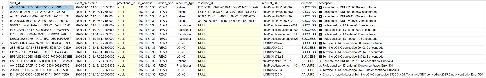

# 📘 Guía de Pruebas: FHIR Resources API (v2.0.0)

## 1. Introducción

Esta guía detalla el protocolo de validación de los endpoints de la API, asegurando la integridad de los datos de salud recuperados desde SQL Server y su correcta transformación al estándar **HL7 FHIR**.

---

## 2. Metodología de Ensayo

Para cada método, se han ejecutado 4 casos de prueba representativos. Se valida:

1. **Status Code**: 200 OK.
2. **Estructura JSON**: Validación del esquema FHIR correspondiente.
3. **Consistencia**: Coincidencia entre el parámetro de entrada y el recurso devuelto.

---

## 3. Ejecución de Pruebas (Juego de Ensayo)

### A. Endpoint: `GET /fhir/Patient/{dni}`

Busca recursos tipo *Patient* basados en el Documento Nacional de Identidad.

| Caso | Input (DNI) | Resultado Esperado | Documentación |
| --- | --- | --- | --- |
| P-01 | `77180539Z` | Recurso Patient (JSON) | [JSON] [Captura] |
| P-02 | `49899238W` | Recurso Patient (JSON) | [JSON] [Captura] |
| P-03 | `20941560Z` | Recurso Patient (JSON) | [JSON] [Captura] |
| P-04 | `27490767V` | Recurso Patient (JSON) | [JSON] [Captura] |
| P-05 | `48102937Z` | ERROR 404 | [Ver Captura LOG] |

> **📸 Imagen de la Prueba P-01:**
>  

### B. Endpoint: `GET /fhir/Practitioner/{id}`

Validación de profesionales sanitarios registrados.

| Caso | Input (ID) | Resultado Esperado | Documentación |
| --- | --- | --- | --- |
| PR-01 | `Aneste001` | Recurso Practitioner (JSON) | [JSON] [Captura] |
| PR-02 | `Dermat009` | Recurso Practitioner | [JSON] [Captura] |
| PR-03 | `enferm111` | Recurso Practitioner | [JSON] [Captura] |
| PR-04 | `medgen123` | Recurso Practitioner | [JSON] [Captura] |
| PR-05 | `enferm110` | ERROR 404 | [Ver Captura LOG] |

> **📸 Imagen de la Prueba PR-01:**
>  

### C. Endpoint: `GET /LOINC/{code}`

Consulta de terminología médica internacional (LOINC).

| Caso | Código LOINC | Descripción del Test | Documentación |
| --- | --- | --- | --- |
| L-01 | `8867-4` | Heart rate | [JSON] [Captura] |
| L-02 | `59408-5` | Oxygen saturation | [JSON] |
| L-03 | `72514-3` | Pain severity | [JSON] |
| L-04 | `18782-3` | Blood pressure | [JSON] |
| L-05 | `2525-3` | ERROR 500 | [Ver Captura LOG] |

> **📸 Imagen de la Prueba L-01:**
>  

---

## 4. Evidencias de Éxito

Para cada una de las 12 pruebas satisfactorias realizadas, se adjunta un archivo `.json` con la respuesta completa del servidor.
Con la siguiente sintaxis: `GET_TipoRecurso_Identificador.json`

> **📸 Inserción de Imagen Final:** Incluye una captura del LOG de las 16 pruebas realizadas.
>

