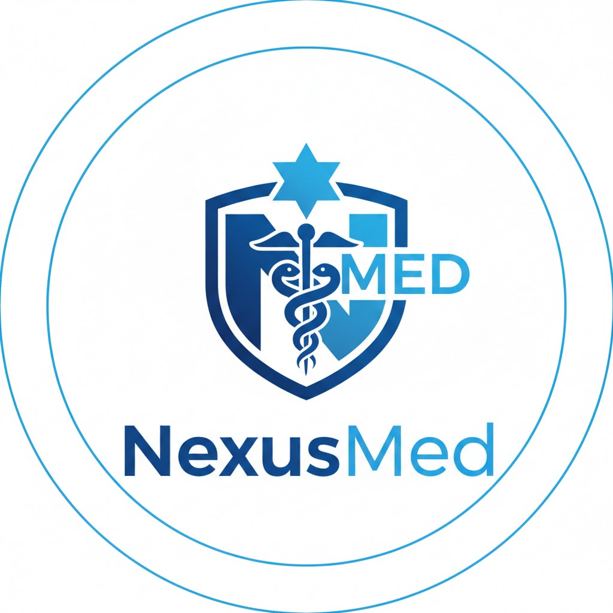
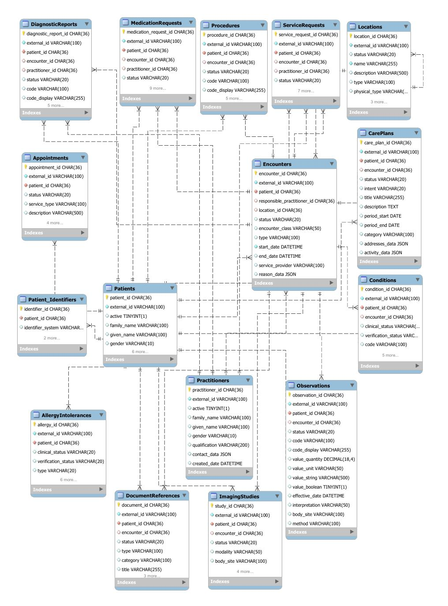

<table border="0">
  <tr>
    <td width="300" align="left" valign="top">
      
    </td>
    <td align="right" valign="top">
      
      
<i>Diagrama E/R: Núcleo Hospitalario (16 tablas principales)</i>

    </td>
  </tr>
</table>

# Framework de Interoperabilidad Clínica End-to-End

Este proyecto implementa un ecosistema completo de gestión de información hospitalaria, simulando el flujo de datos desde la admisión del paciente en Urgencias hasta su alta, integrando estándares internacionales de interoperabilidad (**HL7 v2, FHIR, DICOM**) y terminologías clínicas controladas (**LOINC, SNOMED CT**).

## 🏥 El Escenario Clínico

El sistema modela un flujo de trabajo real de un **Departamento de Urgencias**:

1. **Admisión:** Ingesta de mensajes **HL7 ADT** vía protocolo **MLLP**.
2. **Triaje y Evaluación:** Captura de constantes y evolución clínica mediante recursos **FHIR Observation**.
3. **Ciclo Diagnóstico:** Solicitud de pruebas (**HL7 ORM**) y recepción de resultados e informes radiológicos (**DICOM Metadata** e **Informes FHIR**).
4. **Farmacia:** Prescripción electrónica mediante **FHIR MedicationRequest**.

---

## 🛠 Arquitectura Técnica y Protocolos

El proyecto destaca por su capacidad híbrida de manejar protocolos "legacy" y modernos:

* **Capa de Mensajería (Low Level):** Implementación de un servidor **MLLP (Minimal Lower Layer Protocol)** sobre TCP/IP para la recepción de mensajes HL7 v2.x, con gestión de confirmaciones **ACK (AA/AE/AR)**.
* **Capa de Exposición (API):** API REST desarrollada con **FastAPI** bajo estándares **HTTPS**, exponiendo recursos en formato **JSON FHIR R4/R5**.
* **Validación de Esquemas FHIR (Core Strength):** Se implementa una validación estricta mediante modelos **Pydantic**. Esto garantiza que cualquier recurso (como un `Patient`) cumpla con la cardinalidad, tipos de datos y estructuras requeridas por el estándar HL7 FHIR antes de ser procesado o devuelto por la API.
* **Gobernanza Operativa:** Se busca un equilibrio entre la validación estricta y la **flexibilidad asistencial**, permitiendo la ingesta de datos en escenarios críticos donde la operativa real no puede verse bloqueada por la rigidez del formato.

---

## 📊 Modelado de Datos y Semántica

La base de datos (SQL Server) ha sido diseñada siguiendo la lógica de los recursos FHIR para facilitar el mapeo directo.

### Entidades Core (20 Tablas Principales aprox.)

El diagrama E/R simplificado incluye la gestión de 16 de la Tablas:

* **Sujetos:** `Patients`, `Practitioners`, `Organizations`.
* **Encuentros:** `Encounters` (Vinculación de episodios asistenciales).
* **Clínica:** `Observations` (Resultados), `AllergyIntolerances`, `Conditions` (Diagnósticos).
* **Logística:** `Locations` (Camas, Salas), `ServiceRequests` (Órdenes).

Estas son las Tablas representadas en la BD, asi como su equivalente FHIR. Además de estas en el modelado
de la BD se han incluido las Tablas de LOINC y unas de Terminología HL7(falta por incluir las Tablas SNOMED completas).

| Categoría | Recursos Clave (Resources) | Correspondencia en tu BD |
| --- | --- | --- |
| **Administración** | `Patient`, `Practitioner`, `Organization`, `Location`, `Encounter`, `Appointment`, `Device` | `Patients`, `Patient_Identifiers`, `Practitioners`, `Organizations`, `Locations`, `Encounters`, `Appointments`, `Devices` |
| **Seguridad** | `AuditEvent` | `Audit_Logs` |
| **Terminologia** | `CodeSystem`, `ValueSet` | `CodeSystems`, `Codes` |
| **Exchange** | `MessageHeader` | `HL7_Messages` |
| **Clínica** | `AllergyIntolerance`, `Condition`, `Procedure`, `CarePlan`, `Goal` | `AllergyIntolerances`, `Conditions`, `Procedures`, `CarePlans`, `Goals` |
| **Diagnóstico** | `Observation`, `DiagnosticReport`, `ServiceRequest`, `DocumentReference`, `ImagingStudy`, `Specimen` | `Observations`, `DiagnosticReports`, `ServiceRequests`, `DocumentReferences`, `ImagingStudys`, `Specimens` |
| **Medicación** | `MedicationRequest`,`Immunization` |`MedicationRequests`,`Immunizations` |

### Normalización Semántica

Para evitar la ambigüedad clínica, el sistema integra:

* **LOINC:** Codificación de pruebas de laboratorio y constantes vitales.
* **SNOMED CT:** Codificación de diagnósticos y hallazgos clínicos(de manera sencilla, mediante la Tabla Codes).
* **HL7 Tables:** Gestión de tablas maestras para géneros, estados de encuentro y tipos de identificadores.

---

## 🚀 Características Avanzadas de Implementación

### 1. Motor de Parsing Escalable (Anti-Spaghetti)

En lugar de estructuras monolíticas de decisión (`if/else`), el sistema utiliza un **Patrón de Mapeo por Estrategia**. Cada segmento HL7 (`PID`, `OBX`, `MSH`) es procesado por un handler independiente, permitiendo extender el sistema a nuevos mensajes en minutos.

### 2. Seguridad por Diseño (Inmutabilidad): 
La tabla de auditoría `Audit_Logs` es inmutable por diseño de base de datos. El usuario de la aplicación tiene permisos de `INSERT`, pero tiene denegado el `UPDATE` y `DELETE`, garantizando el cumplimiento de **GDPR/HIPAA**.

### 3. Estrategia de Persistencia JSON: 
Uso de `NVARCHAR(MAX)` con soporte nativo de SQL Server para datos jerárquicos. Este enfoque permite la evolución ágil del esquema FHIR sin sacrificar la capacidad de consulta.

---

## 🛡️ Propiedad Intelectual y Licencia

Este repositorio es un **Showcase Técnico**. La lógica de negocio propietaria y los diccionarios terminológicos completos están omitidos o protegidos bajo licencia **CC BY-NC-ND 4.0**. Para ver implementaciones completas o casos de uso específicos, contactar directamente.

---